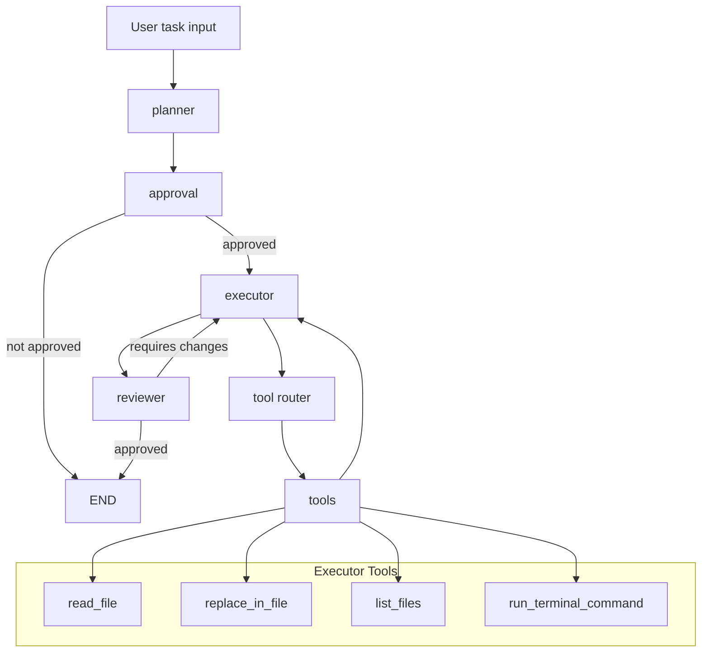

# Mini Cursor

Mini Cursor is a small agentic AI workflow built around a graph-based, tool-enabled code assistant. It integrates planning, approval, execution, review, and retrieval into a structured loop so the agent can inspect a codebase, propose a plan, execute with tools, and verify the result.

## Overview

This project demonstrates a lightweight autonomous coding agent using:

- **LangGraph** for node-based workflow orchestration
- **LangChain / LangChain OLLAMA** for LLM prompts and tool execution
- **Chroma** for vector search over the codebase
- **Pydantic** for structured plan and review responses

The agent is intentionally designed to separate thinking from acting:

- `planner` creates an execution plan
- `approval` asks the user to confirm the plan
- `executor` performs code work with tool access
- `reviewer` inspects results and decides whether to retry

## Architecture

### Core components

- `main.py` — interactive CLI entrypoint
- `app/graph/agent.py` — graph definition and node registration
- `app/graph/router.py` — routing logic for workflow transitions
- `app/graph/state.py` — typed agent state fields
- `app/graph/nodes/` — node implementations for each step
- `app/core/llm.py` — central LLM client configuration
- `app/services/` — planner, retrieval, and indexing services
- `app/tools/` — file, edit, and terminal tools exposed to the agent

### Workflow



1. User enters a task in `main.py`
2. `planner_node` retrieves context and generates a structured `ExecutionPlan`
3. `approval_node` prompts the user to confirm the proposed plan
4. If approved, `executor_node` runs the task using the approved plan
5. The executor can call tools such as `read_file`, `replace_in_file`, `list_files`, and `run_terminal_command`
6. Tool results are routed through the graph so the agent can continue after tool execution
7. `reviewer_node` evaluates the implementation result and may request another execution attempt if changes are required
8. The workflow ends when the review is satisfied or retry limits are reached

### Routing logic

- `planner` always starts first
- `approval` gates execution
- `executor` can optionally invoke `tools`
- `reviewer` decides whether a second pass is needed

## Key files

- `main.py` — user-facing execution loop
- `app/graph/agent.py` — state graph builder
- `app/graph/nodes/planner_node.py` — plan generation logic
- `app/graph/nodes/approval_node.py` — user approval step
- `app/graph/nodes/executor_node.py` — tool-enabled execution
- `app/graph/nodes/reviewer_node.py` — automatic review and retry logic
- `app/services/codebase_indexer.py` — builds the Chroma vector index
- `app/services/retrieval.py` — loads top-K relevant code snippets from the vector store
- `app/prompts/*.py` — system/human prompt definitions for each stage

## Setup

1. Create and activate a Python environment:

```bash
python -m venv venv
source venv/bin/activate
```

2. Install dependencies:

```bash
pip install -r requirements.txt
```

3. Ensure Ollama is available and the configured model is installed:

- `qwen3:8b` for the chat model
- `nomic-embed-text` for embeddings

4. Optionally build or refresh the semantic code index:

```python
from app.services.codebase_indexer import index_codebase
index_codebase('.')
```

The index is persisted under `./chroma_db`.

## Usage

Run the interactive agent:

```bash
python main.py
```

Then enter a task, for example:

- `Refactor the current router logic to support a new approval step`
- `Add a new code review check for failed tool executions`

When prompted, approve the plan with `yes` or `no`.

## How the agent thinks and acts

- `planner_node` uses `app.services.planner.create_plan()` to generate an `ExecutionPlan`
- `approval_node` records whether the user wants to proceed
- `executor_node` loads the plan and retrieved context, then invokes the LLM with tool bindings
- `tools_router` determines whether the agent needs explicit tool execution
- `reviewer_node` evaluates the final output and may loop back to executor if changes are needed

## Notes

- The system is intentionally conservative: it prefers small, safe edits and avoids rewriting files unnecessarily.
- The execution plan is structured with `objective`, `files_to_inspect`, `steps`, and `risks`.
- The review step uses a separate LLM call to validate whether the task was completed correctly.

## Testing

There are a few example tests under `tests/`.

Run them with:

```bash
pytest
```

## Requirements

The project depends on:

- `langgraph`
- `langchain`
- `langchain-ollama`
- `langchain-chroma`
- `chromadb`
- `pydantic`
- `fastapi`
- `uvicorn`
- `python-dotenv`

## License

This repository is provided as a demonstration of a minimal autonomous code assistant workflow.
