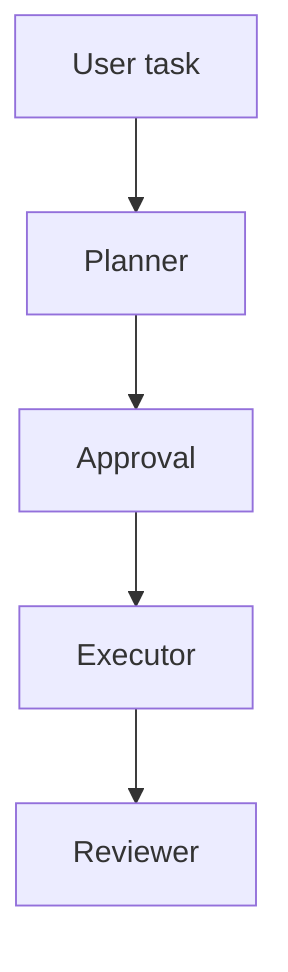
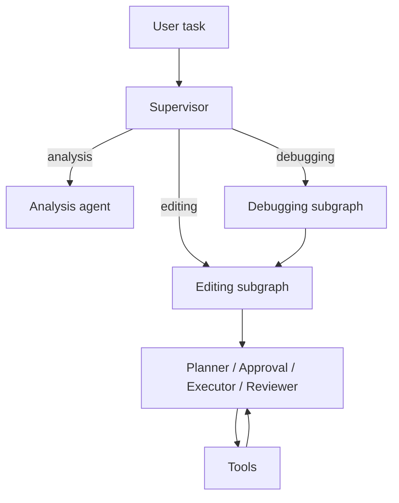

Upgrade notes — linear graph → supervisor + subgraphs
===============================================

Summary
-------

This project moved from a single linear workflow (planner → approval → executor → reviewer) to a supervisor-driven orchestration model that classifies incoming tasks and routes them into focused, reusable subgraphs (e.g., `editing_subgraph`, `debugging_subgraph`). The supervisor is conservative: it only classifies tasks and delegates execution to specialized subgraphs and agents.

### Before vs Now

<table>
<tr>
<td width="50%">

**Before**

- Single top-level graph
- All logic in one linear flow
- No task classification step
- Harder to extend safely

</td>
<td width="50%">

**Now**

- Top-level `supervisor` routes tasks
- Multiple focused subgraphs
- Reusable `editing_subgraph` and composed `debugging_subgraph`
- Clear classification and delegation boundaries

</td>
</tr>
</table>

Why the change
---------------

- Modularity: subgraphs encapsulate domain-specific flows (editing, debugging, analysis), making each flow easier to reason about and test.
- Reusability: subgraphs can be composed (the `debugging_subgraph` embeds `editing_subgraph`) and reused across task types.
- Clear separation of concerns: the `supervisor` LLM only classifies; subgraphs handle planning, approval, execution, and review.
- Safer orchestration: routing decisions are explicit and conservative, which makes portfolio demos easier to explain and audit.

What changed (technical)
------------------------

- A `supervisor_node` (backed by `app.services.supervisor.classify_task`) was added as the entry point in `app/graph/agent.py`.
- The top-level graph now conditionally routes from the `supervisor` to subgraphs using `app/graph/router.supervisor_router`.
- Subgraphs live under `app/graph/subgraphs/` and are compiled `StateGraph` objects that encapsulate their own nodes and routers.
- Existing planner/approval/executor/reviewer logic is preserved, but often expressed inside a subgraph (for example the `editing_subgraph`).

Files to review
---------------

- `app/graph/agent.py`: top-level graph bootstrapping and supervisor node registration
- `app/graph/nodes/supervisor_node.py`: supervisor node implementation
- `app/services/supervisor.py`: LLM-based task classifier prompt
- `app/graph/subgraphs/editing_subgraph.py` and `debugging_subgraph.py`: concrete subgraph implementations

Migration steps (summary)
-------------------------

1. Add a `supervisor` service that performs conservative task classification.
2. Replace the single linear graph start edge with a `supervisor` start node in the top-level graph.
3. Implement subgraphs that encapsulate planner/approval/executor/reviewer loops.
4. Update routers so the `supervisor` routes to the correct subgraph based on classification.
5. Ensure executors reuse the existing tool bindings to avoid duplication.

Developer notes
---------------

- The `supervisor` intentionally does not solve tasks — it only classifies. This design keeps the decision surface small and explainable for portfolio demos.
- If you want to expand: add more subgraphs (e.g., `refactor_subgraph`) and a lightweight policy layer to handle ambiguous classifications.
